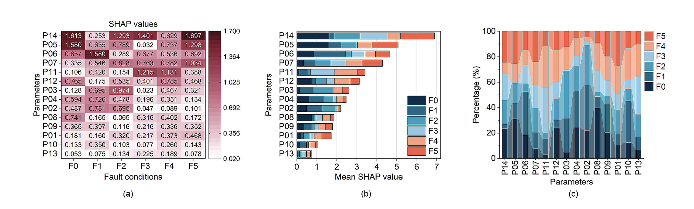
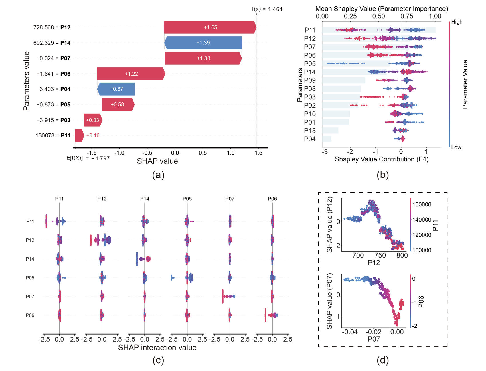
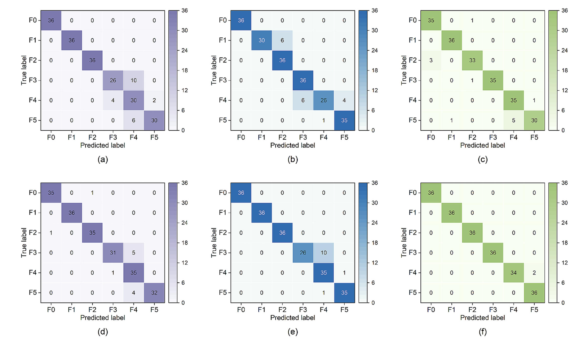
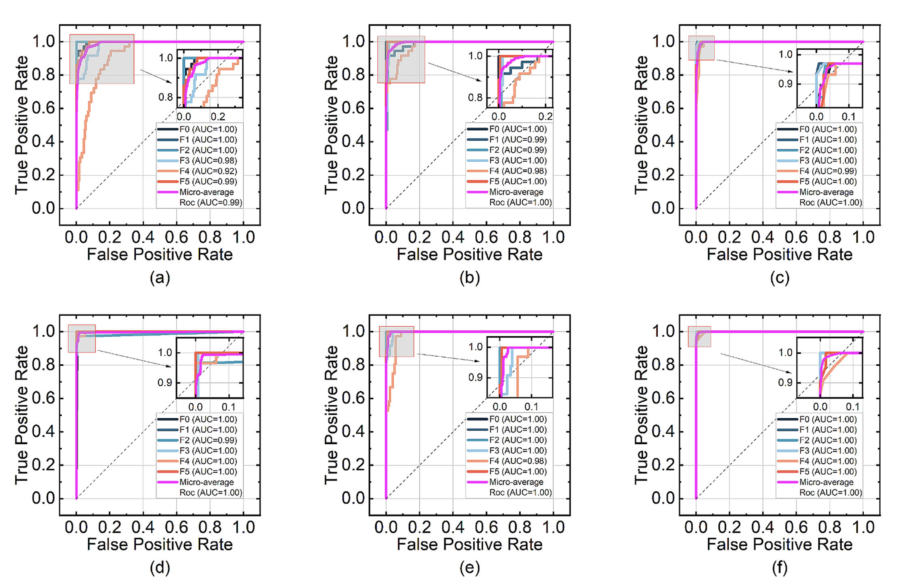

  
  
  
  
  
  <h1>📚 Notas de Lectura: Diagnóstico de fallos explicable basado en simulación termodinámica asistida por Random Forest</h1>
  
Paper: Thermodynamic simulation-assisted random forest for marine diesel engine fault diagnosis

  
  

    <a href="./" style="padding: 5px 10px; background: #f0f0f0; border-radius: 4px; text-decoration: none; color: #333;">简体中文</a> | 
    <a href="README_en.html" style="padding: 5px 10px; background: #f0f0f0; border-radius: 4px; text-decoration: none; color: #333;">English</a> | 
    <a href="#readme" style="padding: 5px 10px; background: #333; border-radius: 4px; text-decoration: none; color: #fff; font-weight: bold;">Español</a> | 
    <a href="README_pt.html" style="padding: 5px 10px; background: #f0f0f0; border-radius: 4px; text-decoration: none; color: #333;">Português</a>
  

> Título del artículo: Thermodynamic simulation-assisted random forest: Towards explainable fault diagnosis of combustion chamber components of marine diesel engines  
> Publicado en: Measurement (2025, Vol.251)  
> Método principal: TSRF (Thermodynamic Simulation-assisted Random Forest)  
> Métrica clave: Precisión media de diagnóstico 99.07%  

## 🔍 Problemas Centrales
El diagnóstico de fallos en las cámaras de combustión de motores diésel marinos se enfrenta a dos problemas principales:
- Métodos basados en datos: Dependen de cantidades masivas de datos etiquetados (escasos en escenarios industriales) y son "cajas negras" con resultados de diagnóstico inexplicables.
- Métodos basados en modelos: Tienen un significado físico claro pero el modelado es complejo y poseen poca flexibilidad ante sistemas no lineales.
- Métodos híbridos: Mejoran la precisión y la interpretabilidad, pero los modelos son complejos y el costo computacional es alto.

> 📈 *Comparación de Ventajas y Desventajas de los Tres Métodos*
> 
| Tipo de Método | Ventajas | Limitaciones |
|----------------|----------|--------------|
| Basado en Modelos | 1. Significado físico claro 2. Adecuado para sistemas con mecanismos claros | 1. Falta de flexibilidad y adaptabilidad 2. Difícil de manejar sistemas no lineales complejos |
| Basado en Datos | 1. Gran adaptabilidad 2. Adecuado para escenarios de Big Data | 1. Alta dependencia de la calidad y cantidad de datos 2. Poca interpretabilidad |
| Híbrido | 1. Precisión relativamente alta 2. Mejor interpretabilidad | 1. Alta complejidad del modelo 2. Alto costo computacional |

## 💡 Solución Innovadora: Método TSRF
El método TSRF (Random Forest asistido por simulación termodinámica) propuesto en el artículo se centra en la fusión de "mecanismo + datos + interpretabilidad":

1. Modelado Termodinámico de Fallos: Reproducción rápida de fallos mediante ajuste de parámetros:
- Primero, se construye un modelo termodinámico 1D que incluye turbocompresor, intercooler y 6 cilindros, estableciendo 6 puntos de monitoreo clave.
- Sin depender de micro-simulaciones complejas, se simulan 5 tipos de fallos típicos + estado normal ajustando los parámetros centrales.

> 📊 Diagrama Estructural del Modelo Termodinámico 1D

*Esta figura muestra el modelo de simulación 1D del motor diésel marino construido en el artículo, incluyendo el turbocompresor (TC1), el intercooler (CO1), los 6 cilindros (C1-C6) y los colectores de admisión/escape (PL1/PL2). El modelo controla el flujo a través de válvulas (MP1-MP6), simulando el proceso de admisión-combustión-escape real, sirviendo como base para el ajuste de parámetros de fallo y la recolección de características.*

2. Selección de 8 parámetros de diagnóstico clave usando valores SHAP:
La simulación genera 14 parámetros termodinámicos (presión del cilindro, temperatura, flujo de calor, etc.). Se utiliza el método Tree SHAP para calcular la importancia de los parámetros y seleccionar 8 principales:
- Temperatura de escape después del turbocompresor (P14)
- Flujo de calor en la pared de la camisa del cilindro (P05)
- Flujo de calor por fugas de gas (Blow-by) (P06)
- Flujo másico de fugas de gas (P07)
- Presión de escape antes del turbocompresor (P11)
- Temperatura de escape antes del turbocompresor (P12)
- Flujo de calor en la pared del pistón (P03)
- Flujo de calor en la pared de la culata (P04)

> 📊 Análisis de Importancia de Parámetros basado en valores SHAP

*Este conjunto de gráficos analiza la contribución de los parámetros al diagnóstico desde 3 perspectivas: 1. Mapa de calor (a): Muestra los valores SHAP (contribución) en diferentes fallos, con P14 y P05 teniendo alta contribución en la mayoría; 2. Gráfico de valor SHAP medio (b): Ordena los parámetros por contribución, confirmando P14, P05 y P06 como claves; 3. Gráfico de proporción (c): Refleja la distribución de correlación entre parámetros y tipos de fallo.*

3. Clasificación con Random Forest + Interpretación de doble perspectiva (local/global):
- Se entrena un modelo Random Forest con los parámetros filtrados para resolver problemas de clasificación múltiple.
- Interpretación local: Uso de gráficos de cascada (Waterfall plot) para analizar la lógica de diagnóstico de una muestra individual.
- Interpretación global: Uso de gráficos de enjambre (Beeswarm plot) para mostrar la contribución general y gráficos de interacción para revelar correlaciones.

> 📊 Análisis del Fallo de Desgaste del Anillo del Pistón basado en SHAP

*Tomando F4 (desgaste del anillo del pistón) como ejemplo: 1. Gráfico de cascada (a): Analiza la lógica de una muestra F4 y muestra las contribuciones positivas/negativas; 2. Gráfico de enjambre (b): Muestra la distribución de contribución de los parámetros para F4 en todas las muestras; 3. Gráfico de interacción (c): Refleja la interacción entre parámetros (ej. P11 y P12); 4. Gráfico de dependencia (d): Clarifica la relación entre valores de parámetros y valores SHAP.*

## 📈 Resultados Experimentales
El artículo calibra el modelo con datos reales de sensores de motores diésel marinos (error < 5%), construye un conjunto de datos de 6 estados (120 muestras cada uno) y compara tres modelos: KNN, SVM y RF:

| Modelo | Precisión (Dataset Original) | Precisión (Subconjunto Óptimo) |
|--------|------------------------------|--------------------------------|
| KNN    | 89.81%±3.73                  | 94.44%±3.24                    |
| SVM    | 92.13%±2.72                  | 94.44%±1.85                    |
| RF     | 99.07%±0.46                  | 99.07%±0.46                    |

> 📊 Matriz de Confusión

*Comparación del rendimiento de clasificación. Figuras (a)-(e): Modelos tradicionales (KNN, SVM) con varios errores; Figura (f): Método TSRF (características SHAP + Random Forest), con muy pocas muestras mal clasificadas, verificando la alta precisión.*

> 📊 Curva de Precisión-Recall

*Verificación del rendimiento por umbrales de clasificación. El método TSRF (f) muestra un AUC cercano a 1.0 para todos los fallos, demostrando estabilidad y alto rendimiento.*

## 🌟 Puntos Destacados
1. Modelado por ajuste de parámetros: Reproducción rápida de características de fallo, resolviendo la escasez de muestras.
2. Selección SHAP multidimensional: No solo selecciona parámetros, sino que revela efectos de interacción.
3. Marco de interpretación dual: Combina mecanismos termodinámicos para lograr un diagnóstico explicable.
4. Alta precisión del 99.07%: Equilibrio entre precisión e interpretabilidad, apto para implementación industrial.

## 📚 Referencias
- Referencia: [1] C. Luo, M. Zhao*, X. Fu, S. Zhong, S. Fu, K. Zhang, X. Yu. Thermodynamic simulation-assisted random forest: Towards explainable fault diagnosis of combustion chamber components of marine diesel engines[J]. Measurement, 2025, 251: 117252.
- Enlace al artículo: https://doi.org/10.1016/j.measurement.2025.117252
- Código y datos del autor: https://ts-rf.github.io/
- Idea central del código: Selección de características basada en Tree SHAP + Clasificación Random Forest.

## 🔖 Nota
Este artículo es una interpretación central del paper de la revista "Measurement" (2025). Es adecuado para desarrolladores en diagnóstico de fallos industriales, ingeniería marina y aplicaciones de aprendizaje automático.

 

  
© 2026 Tech Blog Notes | Paper: <a href="https://doi.org/10.1016/j.measurement.2025.117252">Measurement 2025</a>

   
  <a href="./">简体中文</a> | 
  <a href="README_en.html">English</a> | 
  <a href="#readme">Español</a> | 
  <a href="README_pt.html">Português</a>

